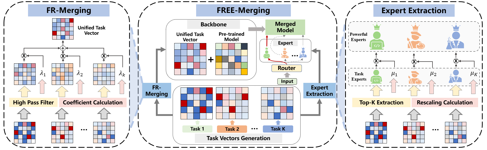

# FREE-Merging

## 🔥 News
- *2025.06*: 🎉 Our [FREE-Merging](https://arxiv.org/abs/2411.16815) is accepted by ICCV 2025.

## Introduction
This is the official implementation of our paper: [FREE-Merging: Fourier Transform for Model Merging with Lightweight Experts](https://arxiv.org/abs/2411.16815). We realize cost-free model merging method with lightweight task-specific experts.

We provide the code for merging ViT models, language models, and Large Language Models. We will gradually open-source the merging code of more models in the future. At the same time, we will continue to improve our code framework.



The workflow of FREE-Merging involves two main steps. First, FR-Merging utilizes high-pass filtering to remove harmful specialized information from each model, thereby constructing a high-quality merged backbone. Second, it employs lightweight extraction of task experts, which are dynamically added during inference to mitigate the impact of task conflicts

## Requirements

Please follow [task_vectors](https://github.com/mlfoundations/task_vectors) and [EMR-Merging](https://github.com/harveyhuang18/EMR_Merging) to install the dependencies.

```
torch==2.3.1
torchvision==0.18.1
transformers==4.37.2
transformers-stream-generator==0.0.5
numpy==1.26.4
triton==2.3.1
typer==0.12.3
visualizer==0.0.1
wandb==0.18.5
fastapi==0.111.0
fastapi-cli==0.0.4
```

## Acknowledgement

Our implementation references the code below, thanks to them.

Task-Vectors: [task_vectors: Editing Models with Task Arithmetic](https://github.com/mlfoundations/task_vectors)

EMR-Merging: [EMR-Merging: Tuning-Free High-Performance Model Merging](https://github.com/harveyhuang18/EMR_Merging)

Twin-Merging: [Twin-Merging: Dynamic Integration of Modular Expertise in Model Merging](https://github.com/LZY-the-boys/Twin-Merging)

Ties-Merging: https://github.com/prateeky2806/ties-merging/tree/main

MergeKit: [arcee-ai/mergekit: Tools for merging pretrained large language models.](https://github.com/arcee-ai/mergekit)

BEiT-3: https://github.com/microsoft/unilm/tree/master/beit3

## Citation

If you find this project helpful for you, feel free to cite our paper:

```
@article{zheng2024free,
  title={FREE-Merging: Fourier Transform for Model Merging with Lightweight Experts},
  author={Zheng, Shenghe and Wang, Hongzhi},
  journal={arXiv preprint arXiv:2411.16815},
  year={2024}
}
```


